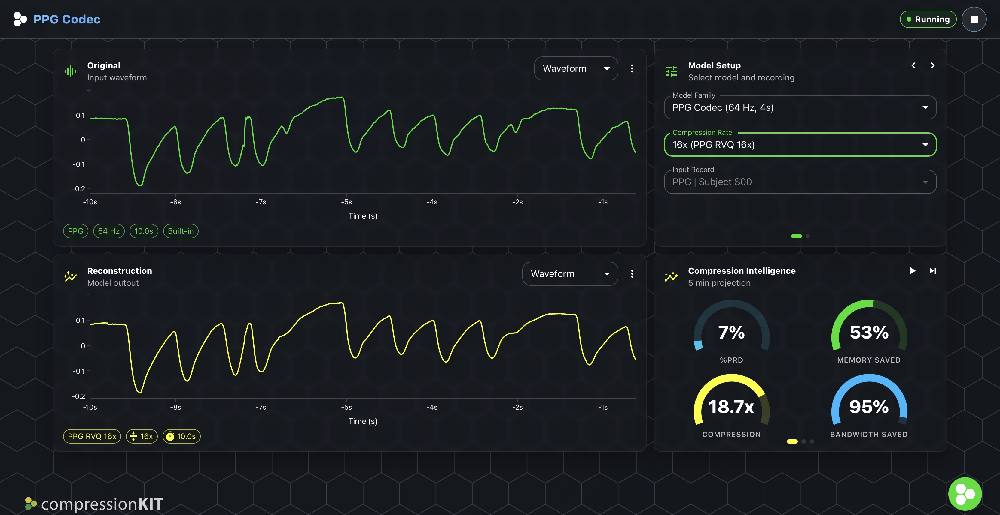
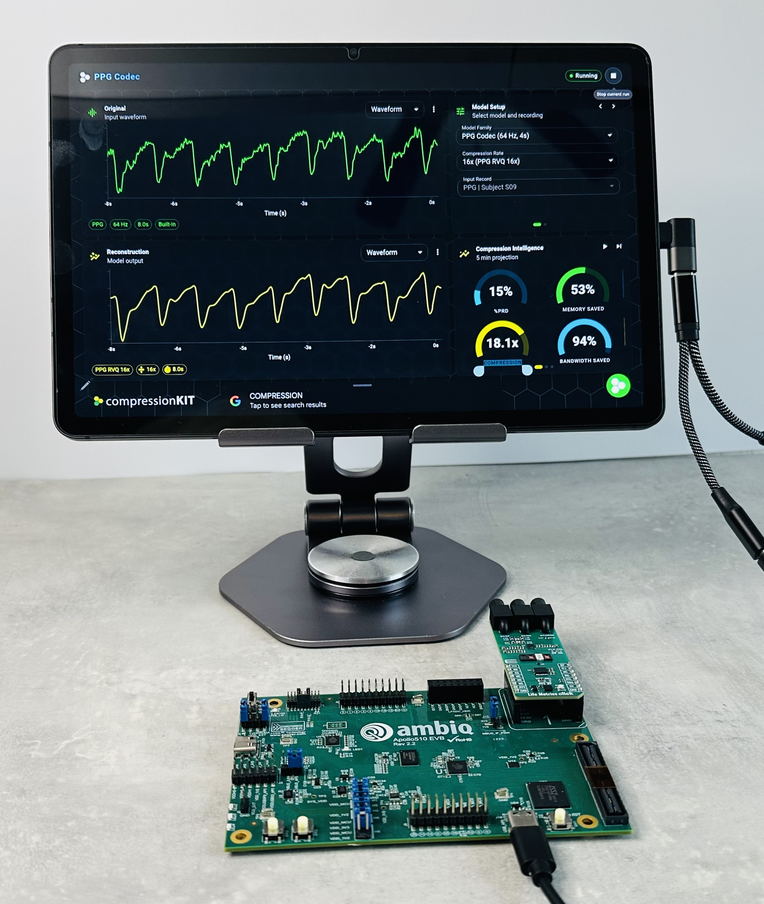
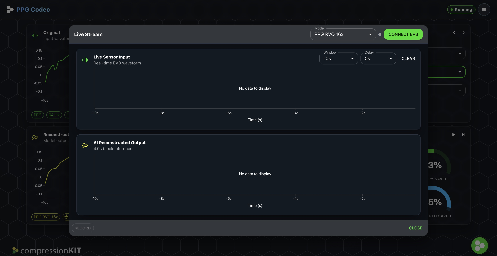
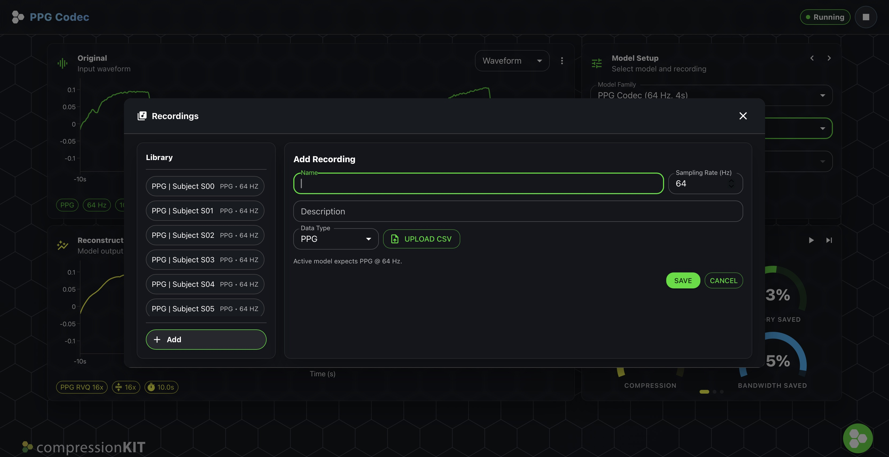

# PPG Codec Demo

The compressionKIT PPG Codec Demo shows what the codec looks like when it is used as part of a complete product evaluation workflow. It combines trained RVQ models, Ambiq hardware integration, browser-based visualization, and live quality metrics in a single interface.

- **Live demo**
  [Open the browser demo](https://ambiqai.github.io/compressionkit-demo/)

- **Primary signal**
  64 Hz PPG in fixed 4 second processing windows

- **Operating points**
  2×, 4×, 8×, and 16× compression options

## Overview

The demo presents a real-time PPG compression and reconstruction workflow designed for customer evaluation, partner discussions, and internal product tradeoff analysis. It highlights how compressionKIT-trained RVQ models can be paired with Ambiq hardware and browser tools to make efficiency gains visible.

Users can work from prerecorded signals in the browser or stream from a connected evaluation board. The app processes the signal in 4 second windows, reconstructs the waveform, and updates waveform, delta, and metrics views live.

## What The Demo Shows

The demo is designed to answer a practical product question: how much memory, bandwidth, and energy can be saved without losing the signal structure a team cares about?

Customers can use it to:

- Compare original and reconstructed PPG waveforms side by side.
- Switch between 2×, 4×, 8×, and 16× model variants.
- Inject representative noise conditions and inspect how the reconstruction responds.
- Review reconstruction quality with PRD and related metrics.
- Translate codec choices into memory savings, bandwidth savings, and deployment-oriented system impact.

## Architecture

The demo pipeline follows the same major stages used in the production workflow:

1. Acquire a 64 Hz PPG stream from the browser or a connected EVB.
2. Split the signal into fixed 4 second windows with overlap-add stitching.
3. Normalize the input and optionally apply demo noise perturbations.
4. Run the encoder, quantize the latent with RVQ codebooks, and reconstruct through the decoder.
5. Stitch the reconstructed windows back into a continuous stream.
6. Update waveform, delta, spectrogram, and quality-efficiency views.

This gives customers a concrete picture of how the codec behaves in a real product path rather than in an isolated notebook or offline script.

## Dashboard Walkthrough

The main dashboard focuses on direct comparison and rapid tradeoff evaluation.

### Original and reconstruction views

The main signal panels show the original input and reconstructed output for the same record. Users can inspect waveform views, switch into spectrogram mode, or use delta views to highlight where the reconstructed signal diverges from the source.

### Control panel

The control area is where teams choose the model variant, compression rate, record, and noise conditions. This is the fastest way to move across the 2× to 16× family and observe how the operating point changes the result.

### Compression intelligence

The metrics panel summarizes both signal quality and system-level value. It highlights:

- PRD as a compact measure of reconstruction difference.
- Effective compression achieved by the selected codec.
- Memory savings relative to the source representation.
- Bandwidth savings for storage or transfer scenarios.
- Deployment-oriented runtime metrics such as latency, footprint, and energy where available.

That combination helps technical and product stakeholders have the same conversation from different perspectives.

## Live Noise Controls

The demo supports baseline wander, transient injection, and Gaussian noise controls. This is useful because customers rarely care only about clean-signal compression. They want to understand whether the operating point remains useful when the source signal is imperfect.

In practice, this means the demo can illustrate both compression and robustness in the same session.

## Live Stream Experience

The live stream dialog is the real-time surface for connected hardware evaluation. It allows users to connect to a compatible EVB over WebUSB, monitor streaming input and reconstructed output, and adjust the display window while data is flowing.

This is useful for showing that the codec is not only trainable offline, but can also sit inside a practical real-time evaluation loop.

## Recordings Experience

The recordings dialog is the library and import surface for offline data. It provides built-in records plus support for user-added CSV recordings so customers can evaluate the codec on representative signals without needing to start from live hardware.

## Demo Setup

The demo is currently oriented around an Ambiq evaluation flow.

### Hardware and software

- 1× Ambiq Apollo510 EVB, Rev 2.2
- 1× Life Metrics Click module
- 1× desktop or laptop system with Chrome
- 2× USB-C cables

### Supported platform today

- `apollo510_evb` — Apollo510 SoC evaluation board

## Flashing Firmware

If the EVB is new or needs a refresh, flash the latest demo firmware before starting a live session.

1. Obtain the current firmware package from your Ambiq contact or the released demo bundle.
2. Connect `MAIN_USB (J16)` and `USB_AP5 (J18)` to the host system.
3. Set switch `SW4` to `ON`.
4. Use SEGGER J-Link tools such as J-Flash Lite to program the board.
5. Once flashed, the board is ready for repeat demo sessions without rebuilding the firmware each time.

## Running The Demo

1. Power the EVB and connect it through `USB_AP5 (J18)`.
2. Open the demo in desktop Chrome.
3. Choose a compression rate and input record.
4. Start playback or connect live streaming.
5. Review waveform fidelity, PRD, and system savings as settings change.

## Why This Matters To Customers

The demo is valuable because it turns compression from an abstract model metric into a product decision surface.

Customers can use it to discuss:

- How much radio traffic can be reduced.
- Whether a higher compression point is acceptable for the intended workload.
- How reconstruction quality changes under more realistic signal conditions.
- Whether inference should stay local, move to the cloud, or combine both paths.

## Positioning Summary

compressionKIT is currently in beta. The demo is intended to help customers and partners evaluate how AI-based compression can extend battery life, reduce data handling cost, and preserve the signal information needed for downstream analytics.
