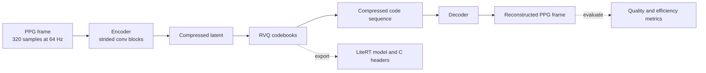

#

[](.)
[](.)

**AI-powered compression for continuous physiological sensing on edge devices.**

compressionKIT helps teams reduce memory footprint, wireless bandwidth, and energy spent moving sensor data around edge systems. The current production workflow focuses on **PPG compression and reconstruction**, with export paths aimed at Ambiq-class embedded deployments and browser-based evaluation tools.

<div class="ck-hero-links" markdown="1">

- [Explore the supported PPG workflow](signals/ppg-workflow.md)
- [Review the 2x-16x v1 operating points](signals/ppg-v1-examples.md)
- [Open the live PPG demo](https://ambiqai.github.io/compressionkit-demo/)

</div>

---

## Key Features

<div class="grid cards" markdown="1">

-   :material-archive:{ .lg .middle } **High Compression Ratios**

    ---

    Explore operating points from 2× through 16× for PPG, with clear tradeoffs between fidelity, bandwidth savings, and deployment cost.

-   :material-chip:{ .lg .middle } **Edge-Ready**

    ---

    Export encoder artifacts as INT8 LiteRT and C headers for Ambiq hardware and adjacent MCU-class deployment targets.

-   :material-puzzle:{ .lg .middle } **Modular Architecture**

    ---

    Train and evaluate from YAML configs, modular Python components, and reusable preprocessing, model, evaluation, and export stages.

-   :material-chart-line:{ .lg .middle } **Clinically Validated**

    ---

    Measure reconstruction quality with MSE, PRD, cosine similarity, and physiology-aware evaluation paths.

</div>

---

## Production Workflow

<div class="ck-section-intro">

The current docs are organized around the path that is fully supported today: train a PPG RVQ codec, compare one of the four published operating points, and evaluate the result in export and demo surfaces.

</div>

<div class="ck-quick-grid" markdown="1">

- **1. Understand the signal**
    Start with the PPG pages for frame sizing, preprocessing, filters, and supported metrics.

- **2. Choose an operating point**
    Use the 2×, 4×, 8×, and 16× examples to match fidelity requirements to system constraints.

- **3. Train and export**
    Run config-driven training, then collect checkpoints, summaries, plots, LiteRT artifacts, and headers.

- **4. Review the demo path**
    Use the dedicated demo section when you want to review the browser and hardware evaluation experience.

</div>

That production path currently centers on a **PPG RVQ codec flow** with:

- 64 Hz PPG input, trained on fixed windows and exported for embedded inference.
- Compression operating points spanning 2×, 4×, 8×, and 16×.
- End-to-end outputs that include checkpoints, evaluation summaries, plots, LiteRT artifacts, and deployment headers.
- A separate demo path for browser-based and hardware-backed evaluation when needed.

The documentation below focuses on the supported PPG path first, then branches into methods, exports, and the dedicated demo material.

---

## Supported Signal Types

| Signal | Status | Sampling Rate | Description |
|--------|--------|---------------|-------------|
| **PPG** | :material-check-circle: Production | 64 Hz (default) | Fully documented training, evaluation, export, and demo flow |
| **ECG** | :material-progress-clock: In Progress | 250-500 Hz | Early support and legacy experimentation, with ongoing migration into the modular flow |

## Compression Methods

| Method | Type | Compression | Status |
|--------|------|-------------|--------|
| **RVQ Autoencoder** | Learned | 2×–16× documented | :material-check-circle: Production |
| **Wavelet + SPIHT** | Classical | 2×–16× | :material-flask: Experimental |
| **Decimation** | Baseline | 2×–16× | :material-flask: Baseline |

---

## Quick Start

```bash
# Install
uv pip install -e .

# Train a PPG RVQ model
train-ppg-rvq --config configs/ppg_rvq_08x.yaml

# Or use the module directly
python -m compressionkit.cli.train_ppg_rvq --config configs/ppg_rvq_08x.yaml
```

## Architecture Overview

<div class="ck-section-intro">

The current reference model is a residual vector quantized autoencoder. Temporal downsampling in the encoder determines the coarse compression stage, and RVQ codebook depth determines how much discrete bitrate is allocated to each latent position.

At a high level, the workflow is straightforward: the encoder compresses the incoming signal into a compact latent representation, the codebooks turn that representation into a compact discrete form, and the decoder reconstructs the waveform from that compressed representation.

</div>

<div class="ck-diagram">

</div>

The encoder reduces the signal into a smaller representation, the **Residual Vector Quantizer** maps that representation through a sequence of learned codebooks, and the decoder reconstructs the waveform from the compressed representation. The total compression ratio is:

$$
\text{CR} = \frac{\text{frame\_size} \times \text{bit\_depth}}{\frac{\text{frame\_size}}{2^N} \times M \times \log_2(K)}
$$

where $K$ is the codebook size and $N$ is the number of encoder stages.

## Where To Go Next

- Start with [signals/ppg-workflow.md](signals/ppg-workflow.md) for the currently supported production workflow.
- Use [signals/ppg-v1-examples.md](signals/ppg-v1-examples.md) to compare the four shipped PPG operating points.
- Visit [demo/ppg-codec.md](demo/ppg-codec.md) for the customer-facing demo overview and hardware setup notes.
