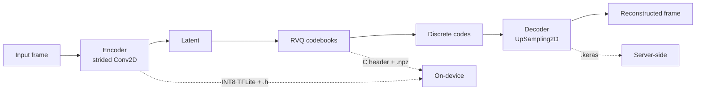

#

[](.)
[](.)

**AI-powered compression for continuous physiological sensing on edge devices.**

compressionKIT helps teams reduce memory footprint, wireless bandwidth, and energy spent moving sensor data around edge systems. It provides end-to-end pipelines for training, evaluating, and deploying neural compression codecs for **PPG** and **ECG** signals, with export paths targeting Ambiq-class MCU deployments and browser-based evaluation tools.

<div class="ck-hero-links" markdown="1">

- [See use cases & savings](use-cases.md)
- [View PPG model zoo](models/ppg.md)
- [View ECG model zoo](models/ecg.md)
- [Open the live PPG demo](https://ambiqai.github.io/compressionkit-demo/)

</div>

---

## What compressionKIT is — and isn't

**Is:** a focused toolkit for *compressing* continuous physiological waveforms (PPG, ECG)
on edge devices. It ships release-grade [golden experiments](experiments/index.md), edge
deploy artifacts (INT8 TFLite + C headers), and a reproducible lifecycle runner that links
configs → training → evaluation → deployment → HuggingFace.

**Is not:** a general-purpose physiological-signal ML framework. It does not classify
arrhythmias, predict sleep stages, or detect events. It focuses on the codec problem and
leaves analytic downstream tasks to dedicated libraries. It is also pre-v1: APIs and
configs may shift on major versions until v1.

---

## Key Features

<div class="grid cards" markdown="1">

-   :material-archive:{ .lg .middle } **2x–32x Compression**

    ---

    Five operating points per signal type (2x, 4x, 8x, 16x, 32x) with clear tradeoffs between fidelity, bandwidth, and deployment cost.

-   :material-chip:{ .lg .middle } **Edge-Ready Export**

    ---

    INT8 quantized encoder as LiteRT + C header for on-device inference. RVQ codebook as C header for embedded lookup. Decoder as Keras model for server-side reconstruction.

-   :material-puzzle:{ .lg .middle } **Modular & Extensible**

    ---

    YAML-driven training with modular Python components: swap datasets, models, losses, and evaluation pipelines independently. Easy to extend to new signal types.

-   :material-chart-line:{ .lg .middle } **Clinical-Aware Metrics**

    ---

    Beyond MSE and PRD: heart-rate and HRV preservation for PPG, Nyquist-aware filtered loss for ECG, and cosine similarity across all operating points.

</div>

---

## Supported Signals

| Signal | Status | Sample Rate | Dataset | Compression Range | Models |
|--------|--------|-------------|---------|-------------------|--------|
| **PPG** | :material-check-circle: Production | 64 Hz | MESA (restricted) | 2x – 32x | [PPG Model Zoo](models/ppg.md) |
| **ECG** | :material-check-circle: Production | 256 Hz | PTB-XL (open) | 2x – 32x | [ECG Model Zoo](models/ecg.md) |

---

## Quick Start

```bash
# Install (dev container with uv)
uv sync

# Train a PPG RVQ codec (8x compression)
python -m compressionkit.recipes.train_ppg_rvq --config configs/ppg_rvq_64hz_08x_golden.yaml

# Train an ECG RVQ codec (8x compression)
python -m compressionkit.recipes.train_ecg_rvq --config configs/ecg_rvq_256hz_08x_golden.yaml
```

Each golden config is source-controlled and produces a complete set of deployment artifacts: encoder TFLite, C headers, codebook, decoder Keras model, sample data, and a deployment manifest.

---

## Architecture Overview

The core model is a **Residual Vector Quantized (RVQ) autoencoder**. The encoder compresses the signal into a compact latent, the RVQ codebooks discretize it, and the decoder reconstructs the waveform.



The compression ratio is:

$$
\text{CR} = \frac{T \times B}{\frac{T}{2^N} \times M \times \log_2(K)}
$$

where $T$ = frame size, $B$ = bit depth, $N$ = encoder stages, $M$ = RVQ levels, $K$ = codebook size.

---

## Datasets

| Dataset | Signal | Native Rate | Access | Download |
|---------|--------|-------------|--------|----------|
| **MESA** | PPG | 256 Hz → 64 Hz | Restricted (NSRR) | Apply at [sleepdata.org](https://sleepdata.org/datasets/mesa), then `export NSRR_TOKEN=...` |
| **PTB-XL** | ECG | 500 Hz → 256 Hz | Open (CC BY 4.0) | Auto-downloaded on first use |

For MESA, after receiving NSRR access approval, you can download programmatically:

```python
from compressionkit.datasets.mesa import MesaDataset
ds = MesaDataset(path="./datasets/mesa")
ds.download(token="your-nsrr-token")  # or set NSRR_TOKEN env var
```

---

## Where To Go Next

<div class="grid cards" markdown>

-   :material-view-grid:{ .lg .middle } **Model Zoo**

    ---

    View the PPG and ECG model pages for v1.0 results, configs, and deployment details.

    [:octicons-arrow-right-24: Browse models](models/index.md)

-   :material-school:{ .lg .middle } **Training Workflow**

    ---

    End-to-end training guides for PPG and ECG, from dataset prep through deployment.

    [:octicons-arrow-right-24: PPG workflow](signals/ppg-workflow.md)

-   :material-book-open-variant:{ .lg .middle } **Methods**

    ---

    Architecture deep-dive: RVQ autoencoder, loss functions, and training recipe.

    [:octicons-arrow-right-24: RVQ autoencoder](methods/rvq.md)

-   :material-map-marker-path:{ .lg .middle } **V1 Roadmap**

    ---

    Execution plan for the release contract: modality and family coverage, golden registry growth, scorecards, deploy packages, and publication milestones.

    [:octicons-arrow-right-24: View roadmap](v1-roadmap.md)

-   :material-monitor-dashboard:{ .lg .middle } **Live Demo**

    ---

    Try the PPG codec demo in your browser, or on Ambiq evaluation hardware.

    [:octicons-arrow-right-24: Open the demo](demo/ppg-codec.md)

</div>
