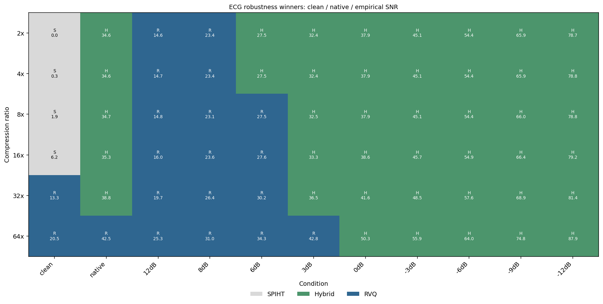
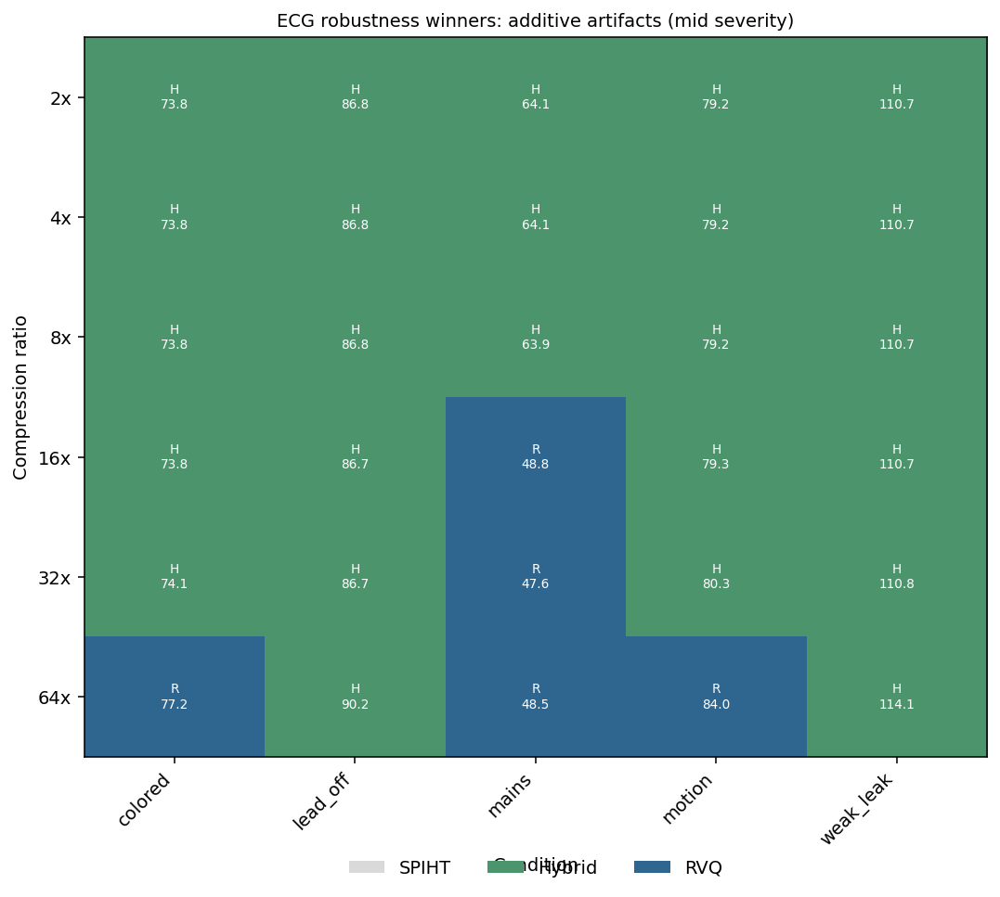

# ECG Models (v1.0)

ECG release artifacts and comparison lanes at 256 Hz using PTB-XL Lead II. The
published HuggingFace bundles are RVQ neural codecs; the local golden registry
also includes SPIHT DSP and hybrid AI+DSP lanes for standardized comparison.

!!! tip "Per-experiment reproduction pages"
    Each entry has a dedicated [experiment page](../experiments/index.md):
    [`ecg-rvq-2x`](../experiments/ecg-rvq-2x.md) ·
    [`ecg-rvq-4x`](../experiments/ecg-rvq-4x.md) ·
    [`ecg-rvq-8x`](../experiments/ecg-rvq-8x.md) ·
    [`ecg-rvq-16x`](../experiments/ecg-rvq-16x.md) ·
    [`ecg-rvq-32x`](../experiments/ecg-rvq-32x.md) ·
    [`ecg-rvq-64x`](../experiments/ecg-rvq-64x.md).
    Two-stage variants: [`ecg-rvq-4x-prior`](../experiments/ecg-rvq-4x-prior.md) ·
    [`ecg-rvq-8x-prior`](../experiments/ecg-rvq-8x-prior.md).

## Published RVQ results

The table below summarizes the published RVQ bundles. These are the v1 packages
available through HuggingFace and the runtime loader.

| Model | Config | CR | PRD (%) | MSE | Cosine |
|-------|--------|----|---------|-----|--------|
| `ecg-rvq-02x` | [`ecg_rvq_256hz_02x_golden.yaml`](https://github.com/AmbiqAI/compressionkit/blob/main/configs/ecg_rvq_256hz_02x_golden.yaml) | 2.00× | 2.50 | 0.000580 | 0.9997 |
| `ecg-rvq-04x` | [`ecg_rvq_256hz_04x_golden.yaml`](https://github.com/AmbiqAI/compressionkit/blob/main/configs/ecg_rvq_256hz_04x_golden.yaml) | 4.00× | 4.09 | 0.001550 | 0.9992 |
| `ecg-rvq-08x` | [`ecg_rvq_256hz_08x_golden.yaml`](https://github.com/AmbiqAI/compressionkit/blob/main/configs/ecg_rvq_256hz_08x_golden.yaml) | 8.00× | 7.48 | 0.005187 | 0.9972 |
| `ecg-rvq-16x` | [`ecg_rvq_256hz_16x_golden.yaml`](https://github.com/AmbiqAI/compressionkit/blob/main/configs/ecg_rvq_256hz_16x_golden.yaml) | 16.00× | 11.18 | 0.011581 | 0.9936 |
| `ecg-rvq-32x` | [`ecg_rvq_256hz_32x_golden.yaml`](https://github.com/AmbiqAI/compressionkit/blob/main/configs/ecg_rvq_256hz_32x_golden.yaml) | 32.00× | 16.04 | 0.023812 | 0.9868 |
| `ecg-rvq-64x` | [`ecg_rvq_256hz_64x_golden.yaml`](https://github.com/AmbiqAI/compressionkit/blob/main/configs/ecg_rvq_256hz_64x_golden.yaml) | 64.00× | 22.35 | 0.046250 | 0.9742 |

All metrics are on the validation set.


## Codec tradeoffs under noise and artifacts

ECG has three release-facing comparison lanes:

| Lane | Role | Current publication status |
|------|------|----------------------------|
| **SPIHT** | DSP faithfulness baseline; very strong on clean low-CR ECG morphology | Registered and reproducible locally; not in v1 HuggingFace bundles |
| **RVQ** | Published neural codec bundles; compact learned representation with ECG morphology scorecards | Published for 2x, 4x, 8x, 16x, 32x, and 64x |
| **Hybrid** | Learned denoising front end with a SPIHT backend; designed for empirical-noise and artifact regimes | Registered and reproducible locally; not in v1 HuggingFace bundles |

The robustness sweep scores each lane against a filtered clean-truth proxy after
injecting empirical noise or additive ECG artifact families. Lower PRD is better.
This complements the validation-set RVQ table above: clean-frame faithfulness and
recoverable morphology under noisy wearable conditions are different questions.

| Condition family | Current ECG crossover pattern |
|------------------|-------------------------------|
| **Clean input** | SPIHT wins at 2x-16x; RVQ wins at 32x-64x in the current robustness fixture. |
| **Native / empirical SNR ladder** | Hybrid wins native conditions through 32x. RVQ is strongest at high-SNR injected noise; hybrid takes over as SNR falls, with the crossover moving by CR. |
| **Additive artifacts** | Hybrid wins most colored, lead-off, motion, and weak-leak cells. RVQ wins mains interference at 16x-64x and motion at 64x in the current fixture. |
| **Morphology checks** | SPIHT is strongest on clean 2x-8x morphology probes; RVQ remains close but is the published neural deployment surface. |





The practical read is that SPIHT is a strong clean ECG baseline, RVQ gives the
published neural CR ladder, and hybrid lanes are most useful when the input is
closer to wearable ECG with empirical noise or contact artifacts. See
[ECG CR vs fidelity](../methods/cr_vs_fidelity_ecg.md) and
[Validation Scorecard](../validation-scorecard.md) for the detailed scorecard
definitions and noise-aware metrics.

## Model Details

### Architecture

All ECG models share the same architecture as PPG models:

- **Encoder**: Strided Conv2D blocks (stride 2 per stage) with depthwise-separable convolutions, followed by a 1×1 projection to `embedding_dim=16`
- **RVQ bottleneck**: EMA-updated codebooks with 256 entries, 8 bits/index
- **Decoder**: UpSampling2D + Conv2D mirror of the encoder
- **Training**: EMA decay 0.99, base filters 48, 200 epochs

### Compression Ratio Breakdown

| Model | Encoder Stages | Downsample | Latent Positions | RVQ Levels | Bits/Frame | CR |
|-------|---------------|------------|-----------------|------------|------------|-----|
| 02x | 1 | 2× | 256 | 2 | 4096 | 2.00× |
| 04x | 2 | 4× | 128 | 2 | 2048 | 4.00× |
| 08x | 3 | 8× | 64 | 2 | 1024 | 8.00× |
| 16x | 4 | 16× | 32 | 2 | 512 | 16.00× |
| 32x | 4 | 16× | 32 | 1 | 256 | 32.00× |
| 64x | 5 | 32× | 16 | 1 | 128 | 64.00× |

Frame size = 512 samples (2 s at 256 Hz). Raw frame = 8192 bits (16-bit). Codebook size K = 256 (8 bits/index).


### Loss Function

- Primary: MSE
- Auxiliary: Derivative loss (weight 0.1) — preserves waveform first-derivative (morphology)

## Dataset: PTB-XL

The [PTB-XL](https://physionet.org/content/ptb-xl/1.0.3/) dataset contains 21,799 12-lead ECG recordings at 500 Hz from 18,885 patients. It is publicly available under the PhysioNet Credentialed Health Data License.

compressionKIT resamples from 500 Hz to 256 Hz and uses Lead II (`lead_index=1`). The dataset is stored as HDF5 files.

### Getting Access

PTB-XL is freely available from PhysioNet:

1. Create an account at [physionet.org](https://physionet.org)
2. Complete the required training (CITI Data or Research Ethics)
3. Sign the data use agreement
4. Download from [PTB-XL v1.0.3](https://physionet.org/content/ptb-xl/1.0.3/)

### Data Preparation

```bash
# Download and convert to HDF5
python -m compressionkit.datasets.ptbxl --download --output datasets/ptbxl
```

Or point the config `data.data_dir` to your existing PTB-XL HDF5 directory.

## Training

```bash
# Train a specific compression ratio
uv run compressionkit golden run ecg-rvq-8x

# Train all six golden configs
uv run compressionkit golden run-all --modality ecg --method rvq
```

### Output Structure

```
results/ecg_rvq_256hz_08x_golden/
├── best_model.weights.h5       # Best checkpoint
├── config.json                 # Frozen config
├── summary.json                # Training metrics
├── training_history_*.csv      # Epoch-by-epoch metrics
├── tensorboard/                # TensorBoard logs
├── plots/                      # Reconstruction plots
└── deploy/                     # Deployment artifacts
    ├── encoder.tflite          # INT8 quantized encoder
    ├── encoder.h               # C header for encoder
    ├── decoder.keras           # Keras decoder model
    ├── decoder_float32.tflite  # Float32 LiteRT decoder for host-side decode
    ├── decoder.tflite          # Optional INT8 decoder for on-device decode
    ├── decoder.h               # Optional C header for INT8 decoder
    ├── codebook.npz            # RVQ codebook weights
    ├── codebook.h              # C header for codebook
    ├── sample_data.npz         # 50 validation samples
    ├── model_card.json         # Metadata used for publishing
    └── deploy_manifest.json    # Artifact manifest
```

## Deployment

For the full runtime guide, see [Deployment Guide](../deployment.md).

### Runtime Profile

- Frame shape: `(1, 1, 512, 1)` float32
- Sample rate: `256 Hz`
- Default HuggingFace repo pattern: `Ambiq/compressionkit-ecg-{cr}x-v1.0`

### Quickstart

```python
import numpy as np

from compressionkit.runtime import RVQCodec

t = np.arange(512, dtype=np.float32) / 256.0
signal = (0.75 * np.sin(2.0 * np.pi * 1.1 * t) + 0.12 * np.sin(2.0 * np.pi * 9.0 * t)).reshape(1, 1, 512, 1)

codec = RVQCodec.from_pretrained("Ambiq/compressionkit-ecg-4x-v1.0")
indices = codec.encode(signal.astype(np.float32))
reconstruction = codec.decode(indices)
```

### Deployment Notes

- PTB-XL-based examples can be validated with synthetic waveforms; deployment does not require dataset access.
- The most common split is encoder plus codebook on-device, decoder off-device.
- ECG models can use the same `RVQCodec` runtime API as PPG even when the training recipe uses transform-domain branches internally.

## Extending

To create a new ECG model variant:

1. Copy an existing golden config: `cp configs/ecg_rvq_256hz_08x_golden.yaml configs/ecg_rvq_256hz_08x_v2.yaml`
2. Modify parameters (e.g. `base_filters`, `num_levels`, `learning_rate`)
3. Train: `uv run train-ecg-rvq --config configs/ecg_rvq_256hz_08x_v2.yaml`
4. Compare results against the golden baseline
